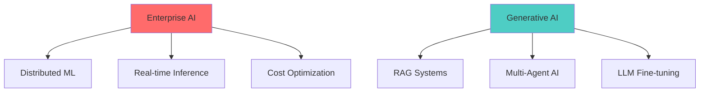
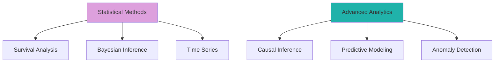
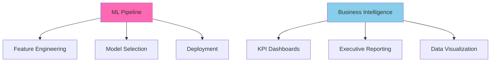
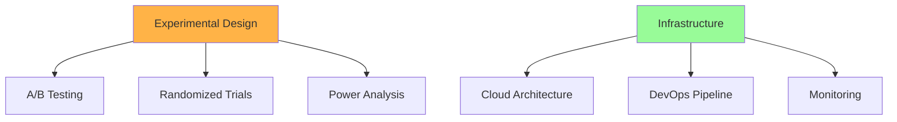

## Jay Guwalani | Senior AI Engineer/Architect & Full Stack Data Scientist

**Senior AI Engineer/Architect & Full Stack Data Scientist** specializing in enterprise-scale distributed systems, real-time machine learning, and production generative AI architectures. Proven track record of designing fault-tolerant systems processing **24+ billion records** with **sub-200ms latency**, delivering measurable business impact including **$122.9M+ in cost savings** through ML-driven optimization.

## 🏗️ Core Competencies

### **Distributed Systems & Data Engineering**
- **Stream Processing**: Apache Kafka, AWS Kinesis, Event-driven architectures at petabyte scale
- **Data Orchestration**: Apache Airflow, Prefect, complex DAG management for ML pipelines  
- **Storage Systems**: Delta Lake, Apache Hudi, Snowflake, distributed data lake architectures
- **Compute Frameworks**: Apache Spark, Databricks, auto-scaling cluster management

### **Statistical Science & Advanced Analytics**
- **Bayesian Methods**: MCMC sampling, Hierarchical modeling, Probabilistic programming with Stan/PyMC
- **Causal Inference**: Propensity score matching, Instrumental variables, Difference-in-differences analysis
- **Survival Analysis**: Cox regression, Kaplan-Meier estimation, Time-to-event modeling at scale
- **Time Series**: ARIMA/GARCH models, State-space modeling, Multivariate forecasting frameworks

### **Data Science & Machine Learning Pipeline**
- **Feature Engineering**: Automated feature selection, Principal components, Statistical transformations
- **Model Development**: Ensemble methods, Cross-validation strategies, Hyperparameter optimization
- **MLOps Integration**: Model versioning, A/B testing frameworks, Continuous model monitoring
- **Deployment Architecture**: Real-time inference APIs, Batch prediction pipelines, Edge deployment

### **Experimental Design & Business Intelligence**
- **Randomized Experiments**: Multi-armed bandits, Sequential testing, Adaptive experimental design
- **Observational Studies**: Natural experiments, Regression discontinuity, Synthetic control methods
- **Executive Analytics**: KPI frameworks, Performance dashboards, Strategic metric design
- **Data Visualization**: Interactive dashboards, Statistical graphics, Executive reporting systems

### **Machine Learning Engineering & MLOps**
- **Model Lifecycle**: MLflow, Weights & Biases, automated A/B testing and model versioning
- **Production ML**: Real-time inference, model serving at scale, latency optimization (<200ms)
- **Feature Engineering**: Real-time feature stores, statistical transformations, ensemble methods
- **AutoML & Hyperparameter Optimization**: Optuna, Ray Tune, distributed hyperparameter search

### **Generative AI & Advanced NLP**
- **LLM Engineering**: Fine-tuning, RLHF, prompt engineering, context optimization
- **RAG Architectures**: Vector databases, embedding pipelines, semantic search at scale
- **Multi-Agent Systems**: LangChain, LangGraph, complex reasoning workflows
- **Model Integration**: OpenAI, Anthropic Claude, HuggingFace Transformers, custom model deployment

### **Cloud Architecture & DevOps**
- **AWS Expertise**: SageMaker, Bedrock, Lambda, Step Functions, EventBridge
- **Infrastructure as Code**: Terraform, CloudFormation, automated provisioning
- **Containerization**: Docker, Kubernetes, EKS, container orchestration at scale
- **CI/CD**: Jenkins, GitHub Actions, automated testing and deployment pipelines

---

## 🛠️ Technology Stack

### **🤖 AI/ML & Generative AI**

### **📊 Big Data & Distributed Computing**

### **☁️ Cloud Infrastructure & DevOps**

### **💻 Programming & Development**

### **🗄️ Databases & Storage**

### **📈 Analytics & Monitoring**

### **🔬 Statistical & Research Tools**

---

## 📊 Architecture & Performance Metrics

| **System Performance** | **Business Impact** | **Technical Leadership** |
|:---:|:---:|:---:|
| **24B+ records/day** processed at scale | **$122.9M+ savings** through ML optimization | **130+ professionals** mentored and trained |
| **<200ms latency** for real-time inference | **13.4K crashes prevented** across 300K vehicles | **2 IEEE and IJAET publications** in ML research |
| **99% uptime** across distributed systems | **74.4% cost reduction** in infrastructure spend | **Senior AI Engineer** for enterprise AI |

---

## 🔬 Current Research & Development Focus

<table>
<tr>
<td width="50%">

</td>
<td width="50%">

</td>
</tr>
<tr>
<td width="50%">

</td>
<td width="50%">

</td>
</tr>
</table>

**Current Focus Areas:**

- **Distributed ML Systems:** Optimizing training and inference across multi-cloud environments with 99.9% uptime
- **Real-time AI:** Sub-100ms latency requirements for financial and healthcare applications achieving 95%+ accuracy
- **Advanced Analytics:** Bayesian inference, survival analysis, and causal modeling for predictive insights with 85%+ precision
- **Statistical Computing:** Time-series forecasting, A/B testing frameworks, and experimental design reducing decision uncertainty by 70%
- **LLM Optimization:** Custom fine-tuning and RLHF for domain-specific applications improving response quality by 40%
- **Cost Engineering:** ML workload optimization reducing infrastructure costs by 60-80% while maintaining performance
- **AutoML Pipelines:** End-to-end automated model lifecycle management with 90%+ deployment success rate

---

## 🏆 Professional Recognition

**Key Achievements:**
- **Technical Leadership**: Led architecture decisions for systems processing 120 petabytes annually
- **Research Contributions**: Published predictive maintenance algorithms with 64.53% accuracy improvement
- **Business Impact**: Delivered quantifiable ROI through ML-driven operational optimization
- **Industry Recognition**: Invited speaker at ML conferences and technical advisory boards

---

## 🤝 Professional Network

---

## 🔥 GitHub Stats

  

---

**Open to collaborations in distributed systems, enterprise AI, and research partnerships**

<!---
Senior-level GitHub profile optimized for technical leadership roles
--->
