## Hi there, I'm Jay Guwalani 👋

I'm an **AI Architect | Senior AI/ML Engineer | Data Scientist**. Specializing in building scalable AI systems, processing billions of records with sub-second latency, and architecting enterprise-grade generative AI solutions—always pushing the boundaries of what's possible with AI & Big Data!

## 🚀 Expertise

* **Generative AI & LLMs** [OpenAI GPT-4 | Claude Sonnet | Hugging Face Transformers | LangChain | LangGraph | RAG Architecture | Multi-Agent Conversational AI | Prompt Engineering | Vector Databases]
* **Big Data & Distributed Computing** [Apache Spark | PySpark | Apache Kafka | AWS Kinesis | Databricks | 24B+ Records Processing | Real-time Streaming | Delta Lake | Apache Hudi | High-frequency Data Pipelines]
* **Data Science & Machine Learning** [Python | R | Matlab | Octave | SQL | MongoDB | DAX | TensorFlow | PyTorch | Scikit-learn | Statistical Modeling | Survival Analysis | Ensemble Methods | Computer Vision | NLP]
* **Data Engineering & MLOps** [AWS Cloud | Apache Airflow | DBT | SageMaker | MLflow | Jenkins | CI/CD | DVC | Databricks | Snowflake | EC2 | AWS SAM | Github Actions | Docker | Kubernetes]
* **Cloud Architecture & Infrastructure** [AWS (Lambda, S3, EC2, SageMaker, Kinesis, Athena, Redshift, Bedrock) | Azure (Databricks, Functions, Kubernetes) | GCP | Serverless | Microservices | Real-time Analytics]
* **Agile Development & Collaboration** [Jira | Asana | Confluence | Scrum | Kanban | DevOps | Git | REST APIs | Microservices Architecture]

## 💻 Check out more about my work  

## 🛠️ Technologies & Tools

<b>🤖 Generative AI & LLM Frameworks</b>

 

<b>📊 Big Data & Streaming Technologies</b>

 

<b>☁️ Cloud & Infrastructure</b>

 

<b>💻 Programming Languages</b>

 

**Frameworks & Libraries:**

<b>📈 Data Visualization & Analytics</b>

 

<b>🛠️ Development Tools & Platforms</b>

 

## 🎯 Recent Highlights

| 🏗️ **Current Role** | 🚀 **Scale Achieved** | 🤖 **AI Systems** |
|:---:|:---:|:---:|
| AI Architect at **Aya Healthcare** | **24B+ records** processed with **sub-200ms latency** | **Multi-Agent AI** supporting **2000+** concurrent users |

| 💰 **Business Impact** | 📊 **Real-time Processing** | ⚡ **Performance** |
|:---:|:---:|:---:|
| **$122.9M+ savings** preventing **13.4K crashes** across **300K vehicles** | **3TB per instance** processed in **<60 seconds** | **99% uptime** with **80% user** satisfaction |

## 🔬 Current Focus

```mermaid
graph LR
    A[🤖 Generative AI] --> B[RAG Architectures]
    A --> C[Multi-Agent Systems]
    
    D[📊 Big Data] --> E[Real-time Analytics]
    D --> F[Petabyte Scale Processing]
    
    G[🔧 MLOps] --> H[Model Lifecycle Management]
    G --> I[Automated CI/CD Pipelines]
    
    J[📈 Analytics] --> K[Survival Analysis]
    J --> L[Ensemble Methods]
    
    M[☁️ Cloud Architecture] --> N[Scalable Solutions]
    M --> O[Cost Optimization]
```

- **🤖 Generative AI Applications**: Implementing RAG architectures and multi-agent systems for enterprise solutions
- **📊 Big Data Processing**: Optimizing distributed computing pipelines for real-time analytics at petabyte scale  
- **🔧 MLOps & Model Deployment**: Streamlining ML model lifecycle management with automated CI/CD pipelines
- **📈 Statistical Modeling**: Advanced survival analysis and ensemble methods for predictive analytics
- **☁️ Cloud Architecture**: Designing scalable, cost-effective solutions on AWS, Azure, and GCP

## 🏆 Key Achievements

## 📫 Connect with me

## 🎵 Currently Vibing To

### Show some ❤️ by starring some of my repositories!

<!---
JayDS22/JayDS22 is a ✨ special ✨ repository because its `README.md` (this file) appears on your GitHub profile.
You can click the Preview link to take a look at your changes.
--->
